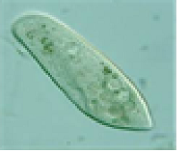
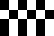
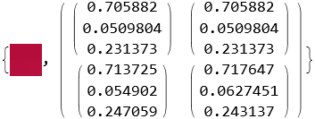
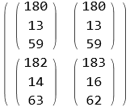
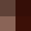
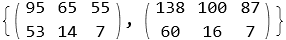
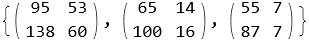
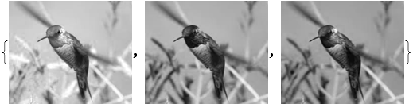
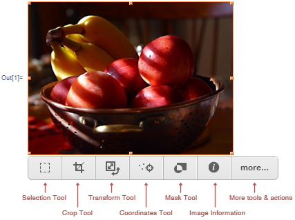

# Глава 1: Обработка изображений

## Характеристики цифрового изображения

1. Типы изображений

Цифровое изображение - это результат аналого-цифрового преобразования (дискретизации) оригинала, представленный в виде массива данных.  
В зависимости от способа дискретизации  выделяют изображения растровые, векторные и смешанного типа.
Растровое изображение - двухмерные массивы данных, расположенных в m строках и n столбцах. Элементом растрового изображения служит пиксель (для изображения, переданного факсом или видео, пелом).  
Для векторного изображения наименьшим элементом является вектор и кривая Безье.

|команда|описание|
|:-|:-|
|[Rasterize[image]](https://reference.wolfram.com/language/ref/Rasterize.html?q=Rasterize)|присваевает растрированную версию image|

Rasterize[

]

Out[]:

Выделяют несколько типов изображений, основные из которых:
- Бинарное (двухуровневое, монохроматическое): пиксели имеют только два значения - два цвета: черный (основной) или белый (цвет фона). Каждый пиксел представлен одним битом.
- Полутоновое (изображение в серых тонах, Grayscale-изображение) : каждый пиксел может иметь 2^n значений - от 0 до  2^n-1,  обозначающих одну из  2^n градаций серого цвета.
Число n  обычно сравнимо с размером байта ( 4, 8, 12, 16, 24 или другое, кратное 4 или 8).  Полутоновое изображение со шкалой из  2^n уровней составлено из n  битовых слоев.
В традиционной Grayscale  шкале пиксель кодируется 8 битами  и может принимать 256 различных значений: от 0 (черный) до 255 (белый).
- Цветное. Существует несколько методов задания цвета.
Качество воспроизведения цвета определяется количеством оттенков, которые могут отображать элементы матрицы пикселей. Оно характеризуется глубиной цвета - количеством бит на пиксель изображения.
Битовый объем каждого пикселя распределяется по цветовым составляющим: каждый цвет кодируется 8 битами. Изображение с глубиной цвета 16 бит/пиксель может воспроизводить 65535 цветов, а 24 бит/пиксель - до 16777215 оттенков. Изображения с глубиной цвета не менее 24 бит (каждый пиксель кодируется как минимум 24 битами ) называют полноцветными.   
Цветовые  составляющие в программе организуются в виде каналов. Цвет изображения определяется совмещенным отображением каналов.  Полноцветные изображения являются многоканальными.

 

2. Цветовая модель

Цветовая модель &mdash; это способ описания представления цвета с помощью количественных характеристик (цветовых компонент, цветовых координат). Они  обычно представлены трех - или четырехзначными числами.
Модель определяет  диапазон доступных цветов (цветовую гамму). Реализация (метод интерпретации) цветовой модели, используемой для определения цветовой гаммы, определяет цветовое пространство.  Для разных цветовых моделей  доступны различные цветовые пространства.
Цветовые модели (RGB, CMYK, HSB,  XYZ, YCbCr и др.) отличаются по способу математического описания цветов.

Наиболее распространена RGB-модель, в которой цвета кодируются с помощью трёх основных цветов: красного, зеленого, синего. Зрительная система человека настроена на восприятие цвета как переменной комбинации этих основных цветов.
Три основные цвета комбинируются  в различных пропорциях для получения составного, полноцветного изображения.
Первичные цвета, добавленные в равных количествах, производят вторичные: голубой (С), пурпурный (М) и желтый (Y) - основные  пигменты, используемые в полиграфической промышленности. С их помощью кодируются цвета в других цветовых моделях (релевантно цветовой модели CMYK: голубой, пурпурный, желтый, черный).

Для отделения информации о цвете от яркости при обработке изображений используют модель HSB , являющейся нелинейным преобразованием модели RGB. Её основные составляющие:
- оттенок - доминирующий цвет, видимый наблюдателем,
- насыщенность - степень разбавления цвета белым,
- яркость - средняя яркость.

Компонент яркости обрабатывается независимо от информации о цвете.

Цветовые пространства, поддерживаемые [Image](https://reference.wolfram.com/language/ref/Image.html?q=Image) и [Image3D](https://reference.wolfram.com/language/ref/Image3D.html):

|1|2|3|4|
|:-:|:-:|:-:|:-:|
|[GrayLevel](https://reference.wolfram.com/language/ref/GrayLevel.html?q=GrayLevel)|[RGBColor](https://reference.wolfram.com/language/ref/RGBColor.html?q=RGBColor)|[CMYKColor](https://reference.wolfram.com/language/ref/CMYKColor.html?q=CMYKColor)|[Hue](https://reference.wolfram.com/language/ref/Hue.html?q=Hue)|
|[XYZColor](https://reference.wolfram.com/language/ref/XYZColor.html?q=XYZColor)|[LABColor](https://reference.wolfram.com/language/ref/LABColor.html?q=LABColor)|[LCHColor](https://reference.wolfram.com/language/ref/LCHColor.html?q=LCHColor)|[LUVColor](https://reference.wolfram.com/language/ref/LUVColor.html?q=LUVColor)|

 

3. Получение изображения

Для обработки изображения оно может быть получено:
-  путём его создания из числовых массивов;
- из имеющейся графики с помощью методов вырезания- вставки;
- импортом из внешних источников.

|команда|описание|
|:-|:-|
|[Image[data]](https://reference.wolfram.com/language/ref/Image.html?q=Image)|растровое изображение со значениями пикселей, заданными data|
|[Import["file"]](https://reference.wolfram.com/language/ref/Image.html?q=Image)|импорт данных из файла|
|[CurrentImage[]](https://reference.wolfram.com/language/ref/CurrentImage.html?q=CurrentImage)|изображения с камеры или другого устройства|

Самый простой способ создать объект изображения - обернуть оператор вокруг действительной матрицы из 0 и 1, соответствующих чёрному и белому цвету.

    Image[{{0., 1., 0., 1., 0., 1.}, {1., 0., 1., 0., 1., 0.}, {0., 1., 0., 1., 0., 1.}, {0., 1., 0., 1., 0., 1.}}]

Out[]:

    Import["ocelot.jpg"]

Out[]:

 

4. Характеристики изображения

Размер изображения определяется по:
-  количеству пикселей по ширине и по высоте (800\*600 px, 1024\*768 px, 1600\*1200 px и т.д.);
- или общему количеству пикселей.

Разрешение изображения:
- выражение m xn;
- число пикселей, приходящихся на единицу длины (площади) изображения.
Разрешение цифрового изображения можно произвольно менять, изменяя физический размер изображения, при неизменном размере матрицы пикселей.

|команда|описание|
|:-|:-|
|[ImageDimensions[image]](https://reference.wolfram.com/language/ref/ImageDimensions.html?q=ImageDimensions)|указывает пиксельный размер растра, ассоцииорованного с image|

img = 

    ImageDimensions[img]
Out[]:

    {416, 312}
 

|команда|описание|
|:-|:-|
|[ImageData[image]](https://reference.wolfram.com/language/ref/ImageData.html?q=ImageData)|выводит массив значений пикселей в image|

ImageData[]

Out[]:

    {{0., 1., 0., 1., 0., 1.}, {1., 0., 1., 0., 1., 0.}, {0., 1., 0., 1., 0., 1.}, {0., 1., 0., 1., 0., 1.}}

Представление фрамента изображения в виде действительной матрицы, маштабированной в диапазоне 0-1.

    {imT = ImageTake[img, {141, 142}, {115, 116}], ImageData[imT] // MatrixForm}
Out[]:

Тот же фрамент в виде целочисленной матрицы, маштабированной в диапазоне 0-255.

    ImageData[ImageTake[img, {141, 142}, {115, 116}], "Byte"] // MatrixForm
Out[]:

|команда|описание|
|:-|:-|
|[ImageAspectRatio[image]](https://reference.wolfram.com/language/ref/ImageAspectRatio.html?q=ImageAspectRatio)|определение отношения высоты к ширине image|
|[ImageChannels[image]](https://reference.wolfram.com/language/ref/ImageChannels.html)|определение количества каналов, присутствующих в данных для image|
|[ImageColorSpace[image]](https://reference.wolfram.com/language/ref/ImageColorSpace.html?q=ImageColorSpace)|определение цветовой модели, используемой в image|
|[ImageType[image]](https://reference.wolfram.com/language/ref/ImageType.html?q=ImageType)|определение типа значений, используемого для каждого пикселя элемента в image|
|[Options[symbol]](https://reference.wolfram.com/language/ref/Options.html?q=Options)|список опций, присвоенных по умолчанию symbol|

|In[]:|Out[]:|
|:-|:-|
|ImageAspectRatio[img]|3/4|
|ImageChannels[img]|3|
|ImageColorSpace[img]|"RGB"|
|ImageType[img]|"Byte"|
|Options[img]|{ColorSpace -> "RGB", ImageResolution -> 120, ImageSize -> {90., Automatic}, Interleaving -> True}|

|команда|описание|
|:-|:-|
|[ImageQ[image]](https://reference.wolfram.com/language/ref/ImageQ.html?q=ImageQ)|True- если image имеет форму, допустимого  Image-объекта, иначе  False|

    ImageQ[img]
Out[]:

    True

 

    list = {"роза", "шипы"};
    ImageQ[list]
Out[]:

    False

 

5. Многоканальное изображение как массив пиксельных данных

Для многоканальных изображений необработанные пиксельные данные представляются 3D массивами, расположенными одним из двух возможных способов, определяемых опцией [Interleaving](https://reference.wolfram.com/language/ref/Interleaving.html?q=Interleaving).

|опция|описание|
|:-|:-|
|Interleaving &rarr; True (по умолчанию) |в виде матрицы из 2D массива списков значения цвета (триплет в RGB);|
|Interleaving &rarr; False|в виде списка матриц, по одной для каждого цветового канала.|

i = 

    iT = ImageTake[i, {76, 77}, {79, 80}]
    MatrixForm /@ ImageData[iT, "Byte", Interleaving -> True]
    MatrixForm /@ ImageData[iT, "Byte", Interleaving -> False]
Out[]:

Многоканальное изображение можно разделить на список одноканальных.

    iS = ColorSeparate[i]
Out[]:

Многоканальное изображение может быть создано из любого количества одноканальных изображений.

    ColorCombine[iS[[#]]] &@{1, 2, 3}
Out[]:

 

6. Интерфейс ImageAssistant

Интерфейс Wolfram Predictive  ImageAssistant  служит эффективным помощником при работе с изображениями. Он предоставляет информацию о характеристиках изображения и инструменты, обеспечивающие его точечную обработку и редактирование.
Появляется при клике мышкой на изображении.

|функция|описание|
|:-|:-|
|Selection Tool|создание копии выбранной части изображения|
|Crop Tool|обрезка изображения|
|Transformation Tool|изменение расположения и размера|
|Coordinates Tool|координаты объектов|
|Mask Tool|создание масок|
|Image Information|характеристики изображения (размер, цветовая модель и др.)|
|More tools & actions|дополнительные возможности обработки|

 

7. Системы координат

Некоторые команды обработки изображений требуют указания определенной позиции в области изображений.
Для её указания  часто необходимо указывать, в какой системе координат производится работа.

 

 

 

 

