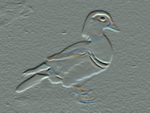
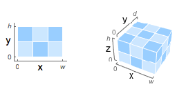
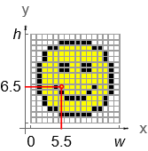
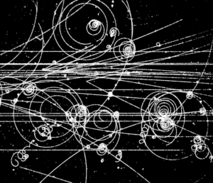
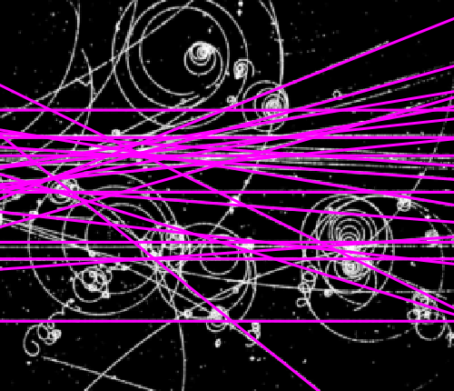

# Глава 1: Обработка изображений   Раздел 1: Характеристики цифрового изображения

## 1. Типы изображений

Цифровое изображение - это результат аналого-цифрового преобразования (дискретизации) оригинального изображения, представленный в виде массива данных.
В зависимости от способа дискретизации выделяют изображения растровые, векторные и смешанного типа.
Растровое изображение является двухмерным массивом данных, расположенных в *m* строках и *n* столбцах. Элементом растрового изображения служит **пиксель** (или **пелом** для изображения переданного факсом или видео).
Для векторного изображения наименьшим элементом является вектор и кривая Безье.

|функция|описание|
|:-|:-|
|[Rasterize](https://reference.wolfram.com/language/ref/Rasterize.html?q=Rasterize)[*image*]|растрированная версия [*image*](#3-получение-изображения)|

`Rasterize[``]`

`Out[]:`

Выделяют несколько типов изображений, основные из которых:
- Бинарное (двухуровневое, монохроматическое): пиксели имеют только два значения - два цвета: черный (основной) или белый (цвет фона). Каждый пиксель представлен одним битом.
- Полутоновое (изображение в серых тонах, Grayscale-изображение) : каждый пиксель может иметь 2n значений - от 0 до 2n-1, обозначающих одну из 2n градаций серого цвета.
Число n обычно сравнимо с размером байта (4, 8, 12, 16, 24, ...; кратное 4 или 8). Полутоновое изображение со шкалой из 2n уровней составлено из n битовых слоев.
В традиционной Grayscale шкале пиксель кодируется 8 битами и может принимать 256 различных значений: от 0 (черный) до 255 (белый).
- Цветное. Существует несколько методов цифрового описания цвета.
Качество воспроизведения цвета определяется количеством оттенков, которые могут отображать элементы матрицы пикселей. Оно характеризуется глубиной цвета - количеством бит на пиксель изображения.
Битовый объем каждого пикселя распределяется по цветовым составляющим: каждый цвет кодируется 8 битами. Изображение с глубиной цвета 16 бит/пиксель может воспроизводить 65535 цветов, а 24 бит/пиксель - до 16777215 оттенков. Изображение с глубиной цвета не менее 24 бит (каждый пиксель кодируется как минимум 24 битами) назывется полноцветным.
Цветовые составляющие в программе организуются в виде каналов. Цвет изображения определяется совмещенным отображением каналов. Полноцветные изображения являются многоканальными.

## 2. Цветовая модель

Цветовая модель &mdash; это способ описания представления цвета с помощью количественных характеристик (цветовых компонент, цветовых координат). Они обычно представлены трех- или четырехзначными числами.
Модель определяет диапазон доступных цветов (цветовую гамму). Реализация (метод интерпретации) цветовой модели, используемой для определения цветовой гаммы, определяет цветовое пространство. Для разных цветовых моделей доступны различные цветовые пространства.
Цветовые модели (**RGB**, **CMYK**, **HSB**, **XYZ**, **YCbCr** и др.) отличаются по способу математического описания цветов.

Наиболее распространена **RGB**-модель, в которой цвета кодируются с помощью трёх основных цветов: красного, зеленого, синего. Зрительная система человека настроена на восприятие цвета как переменной комбинации этих основных цветов.
Три основные цвета комбинируются в различных пропорциях для получения составного, полноцветного изображения.
Первичные цвета, добавленные в равных количествах, производят вторичные: голубой (**С**), пурпурный (**М**) и желтый (**Y**) - основные пигменты, используемые в полиграфической промышленности. С их помощью кодируются цвета в других цветовых моделях (релевантно цветовой модели **CMYK**: голубой, пурпурный, желтый, черный).

Для отделения информации о цвете от яркости при обработке изображений используют модель **HSB**, являющейся нелинейным преобразованием модели **RGB**. Её основные составляющие:
- оттенок &mdash; доминирующий цвет, видимый наблюдателем,
- насыщенность &mdash; степень разбавления цвета белым,
- яркость &mdash; средняя яркость.

Компонент яркости обрабатывается независимо от информации о цвете.

Цветовые пространства, поддерживаемые объектами [Image](#3-получение-изображения) и [Image3D](#3-получение-изображения):

<!--Image3d-->

: [GrayLevel](https://reference.wolfram.com/language/ref/GrayLevel.html?q=GrayLevel)
: [RGBColor](https://reference.wolfram.com/language/ref/RGBColor.html?q=RGBColor)
: [CMYKColor](https://reference.wolfram.com/language/ref/CMYKColor.html?q=CMYKColor)
: [Hue](https://reference.wolfram.com/language/ref/Hue.html?q=Hue)
: [XYZColor](https://reference.wolfram.com/language/ref/XYZColor.html?q=XYZColor)
: [LABColor](https://reference.wolfram.com/language/ref/LABColor.html?q=LABColor)
: [LCHColor](https://reference.wolfram.com/language/ref/LCHColor.html?q=LCHColor)
: [LUVColor](https://reference.wolfram.com/language/ref/LUVColor.html?q=LUVColor)

## 3. Получение изображения

Для обработки изображения оно может быть получено:
- путём его создания из числовых массивов;
- из имеющейся графики с помощью методов вырезания/вставки;
- импортом из внешних источников.

|функция|описание|
|:-|:-|
|[Image](https://reference.wolfram.com/language/ref/Image.html?q=Image)[*data*]|растровое изображение со значениями пикселей, заданными *data*|
|[Import](https://reference.wolfram.com/language/ref/Image.html?q=Image)[*"path"*]|импорт данных из файла с путём *path*|
|[CurrentImage](https://reference.wolfram.com/language/ref/CurrentImage.html?q=CurrentImage)[]|изображения с камеры или другого устройства|

Самый простой способ создать объект изображения - обернуть функцию вокруг действительной матрицы из 0 и 1, соответствующих чёрному и белому цвету.

    Image[{{0., 1., 0., 1., 0., 1.}, {1., 0., 1., 0., 1., 0.}, {0., 1., 0., 1., 0., 1.}, {0., 1., 0., 1., 0., 1.}}]

`Out[]:`

    Import["ocelot.jpg"]

`Out[]:`

## 4. Характеристики изображения

Размер изображения определяется по:
- количеству пикселей по ширине и по высоте (800\*600 px, 1024\*768 px, 1600\*1200 px и т.д.);
- общему количеству пикселей.

Разрешение изображения:
- выражение *m* x *n*;
- число пикселей, приходящихся на единицу длины (площади) изображения.
Разрешение цифрового изображения можно произвольно менять, изменяя физический размер изображения, при неизменном размере матрицы пикселей.

|функция|описание|
|:-|:-|
|[ImageDimensions](https://reference.wolfram.com/language/ref/ImageDimensions.html?q=ImageDimensions)[*image*]|указывает пиксельный размер растра, ассоцииорованного с *image*|

`img = ``;`

    ImageDimensions[img]

`Out[]:`

    {416, 312}

|функция|описание|
|:-|:-|
|[ImageData](https://reference.wolfram.com/language/ref/ImageData.html?q=ImageData)[*image*]|выводит массив значений пикселей в *image*|

`ImageData[``]`

`Out[]:`

    {{0., 1., 0., 1., 0., 1.}, {1., 0., 1., 0., 1., 0.}, {0., 1., 0., 1., 0., 1.}, {0., 1., 0., 1., 0., 1.}}

Представление фрамента изображения в виде действительной матрицы, маштабированной в диапазоне [0, 1].

    {imT = ImageTake[img, {141, 142}, {115, 116}], ImageData[imT] // MatrixForm}

`Out[]:{``, `
$\begin{pmatrix}
    \begin{pmatrix}
        0.705882 \\
        0.0509804 \\
        0.231373
    \end{pmatrix} &
    \begin{pmatrix}
        0.705882 \\
        0.0509804 \\
        0.231373
    \end{pmatrix} \\
    \begin{pmatrix}
        0.713725 \\
        0.054902 \\
        0.247059
    \end{pmatrix} &
    \begin{pmatrix}
        0.717647\\
        0.0627451\\
        0.243137
    \end{pmatrix}
\end{pmatrix}$
`}`

Тот же фрамент в виде целочисленной матрицы, маштабированной в диапазоне [0, 255].

    ImageData[ImageTake[img, {141, 142}, {115, 116}], "Byte"] // MatrixForm
`Out[]:`
$\begin{pmatrix}
    \begin{pmatrix}
        180 \\
        13 \\
        59
    \end{pmatrix} &
    \begin{pmatrix}
        180 \\
        13 \\
        59
    \end{pmatrix} \\
    \begin{pmatrix}
        182 \\
        14 \\
        63
    \end{pmatrix} &
    \begin{pmatrix}
        183 \\
        16 \\
        62
    \end{pmatrix}
\end{pmatrix}$

|функция|описание|
|:-|:-|
|[ImageAspectRatio](https://reference.wolfram.com/language/ref/ImageAspectRatio.html?q=ImageAspectRatio)[*image*]|возвращает [отношение](#4-характеристики-изображения) высоты к ширине *image*|
|[ImageChannels](https://reference.wolfram.com/language/ref/ImageChannels.html)[*image*]|возвращает количество [каналов](#5-многоканальное-изображение-как-массив-пиксельных-данных), присутствующих в данных для *image*|
|[ImageColorSpace](https://reference.wolfram.com/language/ref/ImageColorSpace.html?q=ImageColorSpace)[*image*]|возвращает [цветовую модель](#2-цветовая-модель), используемую в *image*|
|[ImageType](https://reference.wolfram.com/language/ref/ImageType.html?q=ImageType)[*image*]|возвращает тип значений, используемый для каждого пикселя элемента в *image*|
|[Options](https://reference.wolfram.com/language/ref/Options.html?q=Options)[*function*]|возвращает список опций, присвоенных по умолчанию *function*|
|[ImageQ](https://reference.wolfram.com/language/ref/ImageQ.html?q=ImageQ)[*image*]|возвращает `True` если *image* имеет форму, допустимого [Image-объекта](#3-получение-изображения), иначе `False`|

    ImageAspectRatio[img]

`Out[]:`$\frac{3}{4}$

---

    ImageChannels[img]

`Out[]:`

    3

---

    ImageColorSpace[img]

`Out[]:`

    "RGB"

---

    ImageType[img]

`Out[]:`

    "Byte"

---

    Options[img]

`Out[]:`

    {ColorSpace &rarr; "RGB", ImageResolution &rarr; 120, ImageSize &rarr; {90., Automatic}, Interleaving &rarr; True}

---

    ImageQ[img]

`Out[]:`

    True

---

    list = {"роза", "шипы"};
    ImageQ[list]

`Out[]:`

    False

## 5. Многоканальное изображение как массив пиксельных данных

Для многоканальных изображений необработанные пиксельные данные представляются трёхмерными массивами, одной из двух возможных структур.
Эта структура определяется параметром [Interleaving](https://reference.wolfram.com/language/ref/Interleaving.html?q=Interleaving).

|опция|описание|
|:-|:-|
|`Interleaving -> True` (по умолчанию) |в виде матрицы из 2D массива списков значения цвета (триплет в **RGB**);|
|`Interleaving -> False`|в виде списка матриц, по одной для каждого цветового канала.|

`i = ``;`

    iT = ImageTake[i, {76, 77}, {79, 80}]
    MatrixForm /@ ImageData[iT, "Byte", Interleaving -> True]
    MatrixForm /@ ImageData[iT, "Byte", Interleaving -> False]
`Out[1]:`

`Out[2]:`
$`\begin{pmatrix}
    \begin{pmatrix}
        95 & 65 & 55 \\
        53 & 14 & 7
    \end{pmatrix} &
    \begin{pmatrix}
        138 & 100 & 87 \\
        60 & 16 & 7
    \end{pmatrix}
\end{pmatrix}`$

`Out[3]:`
$`\begin{pmatrix}
    \begin{pmatrix}
        95 & 53 \\
        138 & 60
    \end{pmatrix} &
    \begin{pmatrix}
        65 & 14 \\
        100 & 16
    \end{pmatrix}
    \begin{pmatrix}
        55 & 7 \\
        87 & 7
    \end{pmatrix}
\end{pmatrix}`$

|функция|описание|
|:-|:-|
|[ColorSeparate](https://reference.wolfram.com/language/ref/ColorSeparate.html?q=ColorSeparate)[*image*]|Многоканальное изображение можно разделить на список одноканальных.|
|[ColorCombine](https://reference.wolfram.com/language/ref/ColorCombine.html?q=ColorCombine)[{*image1*, *image2*, ...}]|Многоканальное изображение может быть создано из любого количества одноканальных изображений.|

    iS = ColorSeparate[i]
`Out[]: {`, , `}`

    ColorCombine[iS[[#]]] &@{1, 2, 3}
`Out[]:`

## 6. Интерфейс ImageAssistant

Интерфейс Wolfram Predictive ImageAssistant служит эффективным помощником при работе с изображениями. Он предоставляет информацию о характеристиках изображения и инструменты, обеспечивающие его точечную обработку и редактирование.
Появляется при клике мышкой на изображении.

|функция|описание|
|:-|:-|
|Selection Tool|создание копии выбранной части изображения|
|Crop Tool|обрезка изображения|
|Transformation Tool|изменение расположения и размера|
|Coordinates Tool|координаты объектов|
|Mask Tool|создание масок|
|Image Information|характеристики изображения (размер, цветовая модель и др.)|
|More tools & actions|дополнительные возможности обработки|

## 7. Системы координат

Некоторые команды обработки изображений требуют указания определенной позиции в области изображений.
Для разных **систем координат** методы получения области изображения отличаются.

### 7.1 Index Coordinates:

#### Описание:

Массивы пиксельных данных, представляющие изображение, в качестве неотъемленных данных имеют индексы строк и столбцов (дискретная система координат).

`smile = `
$\begin{bmatrix}
    1 & 1 & 1 & 1 & 1 & 1 & 1 & 1 & 1 & 1 & 1 & 1 & 1 & 1 & 1 & 1 \\
    1 & 1 & 1 & 1 & 1 & 0 & 0 & 0 & 0 & 0 & 0 & 1 & 1 & 1 & 1 & 1 \\
    1 & 1 & 1 & 0 & 0 & 1 & 1 & 1 & 1 & 1 & 1 & 0 & 0 & 1 & 1 & 1 \\
    1 & 1 & 0 & 1 & 1 & 1 & 1 & 1 & 1 & 1 & 1 & 1 & 1 & 0 & 1 & 1 \\
    1 & 1 & 0 & 1 & 1 & 1 & 1 & 1 & 1 & 1 & 1 & 1 & 1 & 0 & 1 & 1 \\
    1 & 0 & 1 & 1 & 1 & 0 & 0 & 1 & 1 & 0 & 0 & 1 & 1 & 1 & 0 & 1 \\
    1 & 0 & 1 & 1 & 1 & 0 & 0 & 1 & 1 & 0 & 0 & 1 & 1 & 1 & 0 & 1 \\
    1 & 0 & 1 & 1 & 1 & 1 & 1 & 1 & 1 & 1 & 1 & 1 & 1 & 1 & 0 & 1 \\
    1 & 0 & 1 & 1 & 1 & 1 & 1 & 1 & 1 & 1 & 1 & 1 & 1 & 1 & 0 & 1 \\
    1 & 0 & 1 & 1 & 0 & 1 & 1 & 1 & 1 & 1 & 1 & 0 & 1 & 1 & 0 & 1 \\
    1 & 0 & 1 & 1 & 1 & 0 & 1 & 1 & 1 & 1 & 0 & 1 & 1 & 1 & 0 & 1 \\
    1 & 1 & 0 & 1 & 1 & 1 & 0 & 0 & 0 & 0 & 1 & 1 & 1 & 0 & 1 & 1 \\
    1 & 1 & 0 & 1 & 1 & 1 & 1 & 1 & 1 & 1 & 1 & 1 & 1 & 0 & 1 & 1 \\
    1 & 1 & 1 & 0 & 0 & 1 & 1 & 1 & 1 & 1 & 1 & 0 & 0 & 1 & 1 & 1 \\
    1 & 1 & 1 & 1 & 1 & 0 & 0 & 0 & 0 & 0 & 0 & 1 & 1 & 1 & 1 & 1 \\
    1 & 1 & 1 & 1 & 1 & 1 & 1 & 1 & 1 & 1 & 1 & 1 & 1 & 1 & 1 & 1 \\
\end{bmatrix}$`;`

    smileImg = Image[smile]

Outp[]: 

Спецификации частей, заданные индексами строк и столбцов, четко определены. Первая координата - координата строки, вторая - координата столбца.

    ImageTake[smileImg, {1, 10}, {9, 15}]

Outp[]: 

##### графические примитивы Raster и Image

Пространственное расположение изображения, определенного массивом, неоднозначно.
Нумерация строк осуществляется вертикально: в [Raster](#1-типы-изображений) снизу вверх, в [Image](#3-получение-изображения) сверху вниз. Перечисление столбцов в обоих случаях выполняется горизонтально слева направо.

    Graphics[Raster[smiley], ImageSize -> 64]
    Graphics[Image[smiley], ImageSize -> 64]

`Out[1]:`

`Out[2]:`

#### Примеры:

Индексной системы координат придерживаются WM-функции, работающие как с изображениями, так и с массивами данных: **они сначала перечисляют параметры, относящиеся к вертикальной координате строки, а затем - параметры, относящиеся к горизонтальной координате столбца**.

Например, для сглаживания, уменьшения шума и вычисления производных изображения часто используют [GaussianFilter](https://reference.wolfram.com/language/ref/GaussianFilter.html?q=GaussianFilter), сформированный на основе свертки и использующий Гауссову матрицу в качестве своего базового ядра. При разном указании координаты производной Гаусса получаются разные производные изображения. 
Настройка уровней полученного изображения, масштабированием их на диапазон от [0, 1], происходит с помощью функции [ImageAdjust](https://reference.wolfram.com/language/ref/ImageAdjust.html?q=ImageAdjust).

<!--GaussianFilter-->
<!--ImageAdjust-->

`i = ``;`

    {GaussianFilter[i, 2, {1, 0}] // ImageAdjust, GaussianFilter[i, 2, {0, 1}] // ImageAdjust}

`Out[]:{`, `}`

### 7.2 Image Coordinates:

#### Описание:

Cистема **Image Coordinates** не является внутренней для данных. Она присоединена к пространству вложения: с её помощью определяют область встраивания.
Непрерывная **Image Coordinates** соответствует графической координатной системе. Начинается в нижнем левом углу изображения. 
Область изображения покрывается 2D интервалом [0, *w*] x [0, *h*].

Координаты пикселей изображения имеют целочисленные значения на границах.
Дробная координата однозначно определяет один пиксель: координаты {*i* + 0.5, *j* + 0.5} лежат в центре пикселей.
В случае целочисленных координат {*i*, *j*} учитываются значения либо всех соседних пикселей, либо среднее значение цвета: выделенное изображение будет включать в себя все пиксели, соприкасающиеся с точкой {*i*, *j*}.

##### ImageValue

|функция|описание|
|:-|:-|
|[ImageValue](https://reference.wolfram.com/language/ref/ImageValue.html?q=ImageValue)[*image*, *position*]|вычисление интерполированного значения области изображения в позиции *position*|

`ImageValue[``, {5.5, 6.5}]`

`ImageValue[``, {5., 6.5}]`

`Out[1]:`

    {1., 1., 0.}

`Out[2]:`

    {0.5, 0.5, 0.}

##### ImageTrim

Пример выделения фрагмента с помощью функции [ImageTrim](2_Основные_манипуляции_с_изображением.md#82-удаление-граничных-пикселей-из-изображения)[*image*, *region_of_interest*] по координатами {5, 5} и {16, 16}:

\

`ImageTrim[``, {{5, 5}, {16, 16}}]`

`Out[]:`

#### Примеры:

Команды обработки изображений, неприменимые к произвольным массивам, отображают результаты в стандартных **Image Coordinates**. Они легко использовуются в [Graphics](https://reference.wolfram.com/language/ref/Graphics.html?q=Graphics)-примитивах.
Координаты прямых линий находятся с помощью функции [ImageLines](https://reference.wolfram.com/language/ref/ImageLines.html?q=ImageLines)[*image*] и визуализируются позже.

<!--Graphics-->
<!--ImageLines-->

`img = ``;`

    lines = ImageLines[img];
    HighlightImage[img, lines]

`Out[]:`

---

`img = ``;`

    lines = ImageLines[img, 0.3, 0.3, Method -> {"Segmented" -> True}];
    HighlightImage[img, lines, ImageSize -> 320]

`Out[]:`

### 7.3 Преобразование систем координат:

#### Уравнения для преобразования:

Преобразование между [Index Coordinates](#71-index-coordinates) {r, c} и стандартными [Image Coordinates](#72-image-coordinates) {x, y} для изображения, высотой h:

$$
\begin{cases}
    r = h - y + \frac{1}{2} \\
    c = x + \frac{1}{2}
\end{cases} \to
\begin{cases}
    y = h - r + \frac{1}{2} \\
    x = c - \frac{1}{2}
\end{cases}
$$

#### Маштабирование на 1:

При нормализации [Image Coordinates](#72-image-coordinates) ширину изображения w маштабируют как 1:\
\
Процесс удаления пикселей с каждой стороны, с использованием стандартной и масштабированной системы координат, соответственно

`i = ``;`

    {ImageTrim[i, {{50, 30}, {150, 90}}, DataRange -> Full], ImageTrim[i, {{.25, .25}, {.75, .75}}, DataRange -> {{0, 1}, {0, 1}}]}

`Out[]:{`, `}`

Эта процедура удобна для **операций, не зависящих от размеров изображения**.

|функция|описание|
|:-|:-|
|[ImagePerspectiveTransformation](https://reference.wolfram.com/language/ref/ImagePerspectiveTransformation.html?q=ImagePerspectiveTransformation)[*image*, *param*]|применяет преобразование, заданное *param*|

|вид *param*|преобразование|
|:-|:-|
|матрица *m*|линейное дробное преобразование, заданное матрицей *m*|
|функция преобразования *tf*|применение tf к позиции каждого пикселя в изображении|

`i = ``;`

##### Cдвиг изображения на четверть ширины:

    ImagePerspectiveTransformation[i, TranslationTransform[{-0.25, 0}]]

`Out[]:`

##### Сдвиг в пикселях

    ImagePerspectiveTransformation[i, TranslationTransform[{-80, 0}], DataRange -> Full]

`Out[]:`

#### Система координат, выравненная по пикселям:

Другой модифицированной версией стандартной [Image Coordinates](#72-image-coordinates) является система координат, выравненная по пикселям. Начало координат сдвигается на $\frac{1}{2}$ влево и вниз относительно стандартной системы: целочисленные координаты совпадают с центрами пикселей.

##### Команды, использующие систему координат, выравненную по пикселям:

|функция|`Out[]:`|
|:-|:-|
|[PixelValue](https://reference.wolfram.com/language/ref/PixelValue.html?q=PixelValue)[*image*, *position*]|[значение](#нахождение-значения-пикселя-с-заданной-координатой) пикселя в позиции *position*|
|[PixelValuePositions](https://reference.wolfram.com/language/ref/PixelValuePositions.html?q=PixelValuePositions)[*image*, *value*]|список всех позициий пикселей со значением *value*|
|[PixelValuePositions](https://reference.wolfram.com/language/ref/PixelValuePositions.html?q=PixelValuePositions)[*image*, *value*, *dist*]|[список](#нахождение-позиции-пикселей-со-значениями-в-пределах-заданного-расстояния-от-белого) всех позициий пикселей со значением *value* $\pm$ *dist*|
|[ReplacePixelValue](https://reference.wolfram.com/language/ref/ReplacePixelValue.html?q=ReplacePixelValue)[*image*, *positions* &rarr; *value*]|[*image* со значением пикселей](#замена-цвета-заданных-пикселей) *value* в позициях *positions*|

##### Нахождение значения пикселя с заданной координатой.

`PixelValue[``, {10, 10}]`

`Out[]:`

    0.603922

##### Нахождение позиции пикселей со значениями, в пределах заданного расстояния от белого.

`PixelValuePositions[``, White, .05]`

`Out[]:`

    {{52, 111}, {56, 110}, {56, 109}, {143, 1}}

##### Замена цвета заданных пикселей.

`ppos = PixelValuePositions[`, , 0.5`];`

`ReplacePixelValue[``, ppos -> ``]`

`Out[]:`

`ReplacePixelValue[``, `` -> Red]`

`Out[]:`