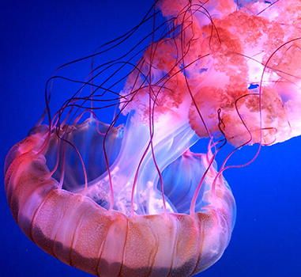
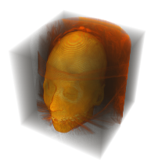
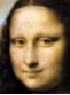
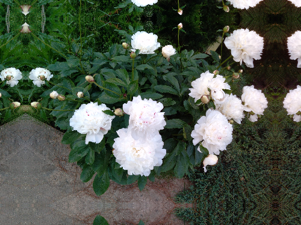
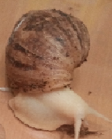
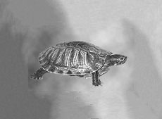
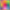

# Глава 1: Обработка изображений   Раздел 2: Основные манипуляции с изображением

## 8. Изменение размеров изображения путем обрезки или заполнения

[Обрезка](#81-обрезка-заданной-области-изображения) позволяет создать новое изображение из выбранной части большего размера.
[Заполнение](#84-расширение-изображения-на-границах) обычно используется для [расширения изображения на границах](#84-расширение-изображения-на-границах), чтобы обеспечить равномерную обработку граничных пикселей во многих задачах обработки изображений.

### 8.1 Обрезка заданной области изображения

|функция|описание|
|:-|:-|
|[ImageTake](https://reference.wolfram.com/language/ref/ImageTake.html?q=ImageTake)[*image*, *n*]|возвращает [первые *n* рядов](#первые-200-строчек) *image*|
|[ImageTake](https://reference.wolfram.com/language/ref/ImageTake.html?q=ImageTake)[*image*, *-n*]|возвращает [последние *n* рядов](#последние-100-строчек) *image*|
|[ImageTake](https://reference.wolfram.com/language/ref/ImageTake.html?q=ImageTake)[*image*, *row1*, *row2*]|возвращает ряды *image* [между *row1* и *row2*](#строчки-от-100-до-200)|
|[ImageTake](https://reference.wolfram.com/language/ref/ImageTake.html?q=ImageTake)[*image*, {*row1*, *row2*}, {*col1*, *col2*}]|возвращает [часть](#строчки-от-30-до-100-колонки-от-260-до-130) *image* ограниченную *row1* и *row2* по вертикали и *col1* и *col2* по горизонтали|
|[ImageTake](https://reference.wolfram.com/language/ref/ImageTake.html?q=ImageTake)[*image3D*, {*slice1*, *slice2*}, {*row1*, *row2*}, {*col1*, *col2*}]|возврящяет [часть](#часть-в-3d-объёме) 3D изображения *image3D* в виде нового 3D изображения, состоящего из сечения *slice*, ограниченного рядами *rows* и колонками *cols*|

#### Детализация:

 $\Rrightarrow$ 

[ImageTake](#81-обрезка-заданной-области-изображения) использует [стандартную спецификацию последовательностей]().
<!---(стандартную спецификацию последовательносте). сделать ссылку-->
При испольховании стандартных [параметров](#padding), если размер исходного изображения меньше чем укаано в аргументах, возвращается лишь существующая часть искходного изображения (размер полученого изображения будет меньше чем указано в аргументах).

#### Примеры:

`ImageTake[``, All, {220, 700}]`

`Out[]:` 

##### обрезка 2D-изображения:

`im = `;

###### первые 200 строчек:

    ImageTake[im, 200]

`Out[]:` 

###### последние 100 строчек:

    ImageTake[im, -100]

`Out[]:` 

###### строчки от 100 до 200:

    ImageTake[im, {100, 200}]

`Out[]:` 

###### строчки от 30 до 100; колонки от 260 до 130:

    ImageTake[im, {30, 100}, {260, 330}]

`Out[]:` 

###### 100я строчка:

    ImageTake[im, {100}]

`Out[]:` 

###### строчки c 1 по последнюю через 5:

    ImageTake[im, {1, -1, 5}]

`Out[]:` 

###### столбцы с 1 по 300:

    ImageTake[im, All, 300]

`Out[]:` 

    ImageTake[im, {230, 330}, {200, 300}](*строчки 230-330, столбцы 200-300*)

`Out[]:` 

##### обрезка 3D-изображения:

`im3D = `

    ImageDimensions[im3D]

`Out[]:`

    {256, 256, 99}

###### верхние 80 слоёв:

    ImageTake[im3D, 80]

`Out[]:` 

###### нижние 80 слоёв:

    ImageTake[im3D, -80]

`Out[]:` 

###### 45й слой:

    ImageTake[im3D, {45}]

`Out[]:` 

###### все слои в указанной области:

    ImageTake[im3D, All, -150, -150]

`Out[]:` 

###### часть в 3D объёме

    ImageTake[im3D, {30, 80}, {215, 256}, {80, 130}]

`Out[]:` 

###### Интерактивное изменение выделения вырезаемых фрагментов.

    im3DDims = ImageDimensions[im3D]
    Manipulate[ImageTake[im3D, {s1, s2}, {r1, r2}, {c1, c2}], {r1, 1, im3DDims[[1]]}, {r2, 1, im3DDims[[1]]}, {c1, 1, im3DDims[[2]]}, {c2, 1, im3DDims[[2]]}, {s1, 1, im3DDim[[3]]}, {s2, 1, im3DDims[[3]]}]
`Out[1]:`

    {256, 256, 99}

`Out[2]:` 

#### Применение:

##### Нахождение интересующей области (в координатах), выделение ее на исходном изображении и обрезка:

`i = `;

    ImageDimensions[i]

`Out[]:`

    {251, 201}

---

    {x, y} = Round[MinMax /@ Transpose[ImageKeypoints[i, KeypointStrength -> 0.0001]]]
    HighlightImage[i, Rectangle @@ Transpose[{x, y}]]
    ImageTake[i, Sort[201 - y], Sort[x]]

`Out[1]:`

    {{29, 169}, {88, 142}}

`Out[2]:` 

`Out[3]:` 

#### Взаимосвязь с другими WM-функциями:

|функция|аналог|описание|
|:-|:-|:-|
|[ImageReflect](https://reference.wolfram.com/language/ref/ImageReflect.html?q=ImageReflect)[*image*]|[ImageTake](#81-обрезка-заданной-области-изображения)[*image*, {-1, 1}]|переворот изображения *image*|<!--ImageReflect-->
|[Downsample](https://reference.wolfram.com/language/ref/Downsample.html?q=Downsample)[*image*, *k*]|[ImageTake](#81-обрезка-заданной-области-изображения)[*image*, {1, -1, *k*}, {1, -1, *k*}]|понижение дискретизации *image* путём возвращения каждого *k*-нного пикселя|<!--Downsample-->

`im = `

    {ImageReflect[im], ImageTake[im, {-1, 1}]}

`Out[]:` {, }

    {Downsample[im, 3], ImageTake[im, {1, -1, 3}, {1, -1, 3}]}

`Out[]:` {, }

### 8.2 Удаление граничных пикселей из изображения

|функция|описание|
|:-|:-|
|[ImageCrop](https://reference.wolfram.com/language/ref/ImageCrop.html?q=ImageCrop)[*image*]|[обрезка](#примеры-вариантов-обрезки-изображения-результатов-тонкослойной-хроматографии) *image* путем удаления границ однородного цвета|
|[ImageCrop](https://reference.wolfram.com/language/ref/ImageCrop.html?q=ImageCrop)[*image*, *size*]|[обрезка](#тонкослойная-хроматография-2) *image* по заданным границам [*size*](#size-1) со всех сторон|
|[ImageCrop](https://reference.wolfram.com/language/ref/ImageCrop.html?q=ImageCrop)[*image*, *size*, *side*]|[обрезка](#примеры-вариантов-обрезки-изображения-результатов-тонкослойной-хроматографии) *image* по заданным границам [*size*](#size-1) со сторон заданных [*side*](#side-1)|

[ImageCrop](#82-удаление-граничных-пикселей-из-изображения) дополняет [ImageTake](#81-обрезка-заданной-области-изображения). Эта функция используется для удаления ненужных или извлечения интересующих областей.
Эффективно удаляет из изображения границы, распределение значений пикселей которых почти однородно.

#### обрезка фона, на котором сфотографирован мазок крови:

`ImageCrop[``]`

`Out[]:` 

#### Детализация и опции:
[1]

При выполнении [функции](#82-удаление-граничных-пикселей-из-изображения) указывается [количество](#size-параметры) строк и/или столбцов относительно центра изображения, которые должны быть сохранены.
По умолчанию пиксели срхраняются [симметрично](#side-параметры).

 $\Rightarrow$ 

##### size-параметры:

- size-параметры
    |параметр|описание|
    |:-|:-|
    |*width*|[конкретная](#тонкослойная-хроматография-2) ширина и пропорциональная высота|
    |{*width*, *height*}|[конкретные](#тонкослойная-хроматография-3) ширина и высота|
    |{*width*, *depth*, *height*}|конкретные ширина, глубина и высота для 3D-изображений|
    |*width*{1, r}|получить изображение с соотношением сторон r|
- возможные значенмя
    |значение|описание|
    |:-|:-|
    |*d*|*d* [пикселей](#тонкослойная-хроматография-2)|
    |[UpTo](https://reference.wolfram.com/language/ref/UpTo.html?q=UpTo)[*d*]|максимум *d* [пикселей](#тонкослойная-хроматография-перевёрнутая)|
    |{*dmin*, *dmax*}|область пикселей |
    |[Automatic](https://reference.wolfram.com/language/ref/Automatic.html?q=Automatic)|автоматическое пропорциональное [значение](#тонкослойная-хроматография-5)|
    |[Full](https://reference.wolfram.com/language/ref/Full.html?q=Full)|не делать [обрезку](#тонкослойная-хроматография-4) в этом измерении|

##### side-параметры:

- side-параметры
    |параметр|описание|
    |:-|:-|
    |*side*|[обрезка](#тонкослойная-хроматография-6) стороны *side* и центрирование по противоположной|
    |{*side1*, *side2*}|[обрезка](#тонкослойная-хроматография-9) сторон siden|
    |{*ax*, *by*}|доли [обрезки](#тонкослойная-хроматография-7) каждой стороны|
- возможные значения
    |значение|описание|
    |:-|:-|
    |[Left](https://reference.wolfram.com/language/ref/Left.html?q=Left)|[обрезка](#то) левой стороны|
    |[Right](https://reference.wolfram.com/language/ref/Right.html?q=Right)|[обрезка](#тонкослойная-хроматография-9) правой стороны|
    |[Bottom](https://reference.wolfram.com/language/ref/Bottom.html?q=Bottom)|обрезка нижней стороны|
    |[Top](https://reference.wolfram.com/language/ref/Top.html?q=Top)|[обрезка](#обрезка-верхних-23-слоёв) верхней стороны|
    |[Center](https://reference.wolfram.com/language/ref/Center.html?q=Center)|[обрезка](#тонкослойная-хроматография-9) симметрично всех сторон|

#### Примеры:

##### примеры вариантов обрезки изображения результатов тонкослойной хроматографии:

`i = `

###### тонкослойная хроматография 1:

    ImageCrop[i]

`Out[]:`

###### тонкослойная хроматография 2:

    ImageCrop[i, 200]

`Out[]:`

###### тонкослойная хроматография 3:

    ImageCrop[i, {200, 200}]

`Out[]:`

###### тонкослойная хроматография 4:

    ImageCrop[i, {200, Full}]

`Out[]:`

###### тонкослойная хроматография 5:

    ImageCrop[i, {Automatic, 200}]

`Out[]:`

###### тонкослойная хроматография 6:

    ImageCrop[i, 180, Left]

`Out[]:`

###### тонкослойная хроматография 7:

    ImageCrop[i, 180, {-1, 0}],

`Out[]:`

###### тонкослойная хроматография 8:

    ImageCrop[i, 180, {-.5, 0}]

`Out[]:`

###### тонкослойная хроматография 9:

    ImageCrop[i, 150, {Right, Center}]

`Out[]:`

###### тонкослойная хроматография перевёрнутая:

    ImageCrop[ImageRotate[i], UpTo[290]]

`Out[]:` 

##### обрезка 3D-изображения:

`im3D = `

    ImageDimensions[im3D]

`Out[]:`

    {46, 46, 46}

###### обрезка верхних 23 слоёв:

    ImageCrop[im3D, {Full, Full, 23}, Top]

`Out[]:` 

###### горизонтальное сечение:

    ImageCrop[i, {Full, Full, 1}, {0, 0, 0.5}]

`Out[]:` 

###### обрезка заданного объёма:

    ImageCrop[i, {23, 23, Full}, {-1, 1, 1}]

`Out[]:` 

#### Опции:

##### [Padding](<!--Padding-->):

Если указанная для удаления ширина или высота больше, чем само изображение, создаётся буфер путём добавления пикселей симметрично или в соответствии с настройкой [Padding](<!--Padding-->) 
<!---(раздел Общие опции). сделать ссылку-->

`{ImageCrop[``, 400], ImageCrop[``, 400, Padding -> Automatic]}`

`Out[]: {`, `}`

###### примеры использования [Padding](#padding-82):

`i = `

    {ImageCrop[i, 500], ImageCrop[i, 500, Padding -> Red], ImageCrop[i, {500, Full}, Padding -> Green]}

`Out[]:` {, , }

###### зеркальное отражение [Padding](#padding-82):

    {ImageCrop[i, 500, Padding -> "Fixed"], ImageCrop[i, 500, Padding -> "Reflected"]}

`Out[]: {`, `}`

###### Сравнение результатов с опцией [Padding](#padding-82) и без

<!--Padding-->

При использовании опции `Padding -> None` размер получаемого изображения может быть меньше исходного.

<!--Padding-->

    ImageCrop[i, {500, Full}]
    ImageDimensions[%]
    ImageCrop[i, {500, Full}, Padding -> None]
    ImageDimensions[%]

`Out[1]:` 

`Out[2]: {500, 312}`

`Out[3]:` 

`Out[4]: {416, 312}`

#### Приминение:

##### обрезка рамки:

Обрезка рамки происходит, если она присутствует по крайней мере с двух сторон.

`{ImageCrop[``], ImageCrop[``]}`

`Out[]: {``, ``}`

### 8.3 Извлечение областей из изображения

|функция|описание|
|:-|:-|
|[ImageTrim](https://reference.wolfram.com/language/ref/ImageTrim.html?q=ImageTrim)[*image*, *roi*]|из *image* [вырезается](#вырезка-области-изображения-по-заданным-координатам) меньшее изображение, так, чтобы оно включало в себя область интереса [*roi*](#roi-83)|
|[ImageTrim](https://reference.wolfram.com/language/ref/ImageTrim.html?q=ImageTrim)[*image*, *roi*, *r*]|из *image* [вырезается](#margin-83) меньшее изображение, так, чтобы оно включало в себя область интереса [*roi*](#roi-83) и окружающий его марджин (запас) размера [*r*](#r-83)|
|[ImageTrim](https://reference.wolfram.com/language/ref/ImageTrim.html?q=ImageTrim)[image, {*roi1*, *roi2*, ...}, ...]|из *image* [вырезается](#вырезка-нескольких-областей) множество подизображений, заданных спецификациями [*roin*](#roi-83)|

[ImageTrim](#83-извлечение-областей-из-изображения) удаляет граничные пиксели из изображения. Обычно используется для извлечения интересующих областей.

#### Детализация и опции:

В качестве аргументов в функцию передаётся количество строк и/или столбцов относительно центра изображения, которые должны быть сохранены.
По умолчанию пиксели удаляются симметрично. 

 $\Rrightarrow$ 

##### *roi*-параметры:

|спецификация|описание|
|:-|:-|
|{{x1, y1}, ...}|[список](#вырезка-изображения-1го-пикселя) координат для 2D изображения|
|{{x1, y1, z1}, ...}|[список](#вырезка-объёмов-из-3d-изображения) координат для 3D изображения|
|*region*|2D или 3D геометрические [области](#вырезка-прямоугольной-области) ([Point](https://reference.wolfram.com/language/ref/Point.html?q=Point), [Disk](https://reference.wolfram.com/language/ref/Disk.html?q=Disk), [Sphere](https://reference.wolfram.com/language/ref/Sphere.html?q=Sphere), ...)|
|*maskimage*|2D или 3D [маска](#вырезка-по-маске) содержащая ненулевые пиксели - трафарет|
|*f*|область, заданная [функцией](#вырезка-заданной-функции) f|

<!--СДЕЛАТЬ ОБЩУЮ СПЕЦИФИКАЦИЮ ДЛЯ REGION-->

##### *r*-параметры:

|спецификация|описание|
|:-|:-|
|*r*|[марджин](#margin-83) со всех сторон|
|{*rx*, *ry*}|разный марджин по-вертикали и по-горизонтали|

###### опции по умолчанию:

|опция|описание опции|стандартное значение|
|:-|:-|:-|
|[DataRange](https://reference.wolfram.com/language/ref/DataRange.html?q=DataRange)|обрабатываемая [область](#datarange-83) *image*|[Full](https://reference.wolfram.com/language/ref/Full.html?q=Full)|
|[Padding](https://reference.wolfram.com/language/ref/Padding.html?q=Padding)|По умолчанию, если существует меньше элементов, чем требуется, [ImageTrim](#83-извлечение-областей-из-изображения) изображения будет возвращать только те элементы, которые присутствуют. Эта [настройка](#padding-83) позволит задать схему заполнения пикселей за пределами исходного изображения|[None](https://reference.wolfram.com/language/ref/None.html?q=None)|

<!--СДЕЛАТЬ ОБЩУЮ СПЕЦИФИКАЦИЮ ДЛЯ DATARANGE-->

#### Примеры:

##### фотография улиток:

`i = `;
 
    ImageDimensions[i]

`Out[]:`

    {319, 302}

###### вырезка изображения 1го пикселя:

    ImageTrim[i, {140, 30}]

`Out[]:` 

###### вырезка области изображения по заданным координатам:

    ImageTrim[i, {{160, 10}, {70, 120}}]

`Out[]:` 

###### вырезка прямоугольной области:

    ImageTrim[i, Rectangle[{220, 20}, {140, 90}]]

`Out[]:` 

###### это эквивалентно случаю, когда маржа r = 0

    ImageTrim[i, Rectangle[{220, 20}, {140, 90}], 0]

`Out[]:` 

###### cлучай когда маржа r $\not =$ 0:

    ImageTrim[i, Rectangle[{220, 20}, {140, 90}], 40]

`Out[]:` 

###### вырезка по маске:

`ImageTrim[i, ``]`

`Out[]:` 

###### вырезка заданной функции:

    ImageTrim[i, PixelValuePositions[#, White, .4] &]

`Out[]:` 

###### вырезка нескольких областей:

    ImageTrim[i, {Rectangle[{220, 20}, {140, 90}], Rectangle[{300, 100}, {140, 300}]}]

`Out[]:` {, }

###### обрезка области вокруг максимума:

    ImageTrim[i, ImageValuePositions[#, "Max"] &, 140]

`Out[]:` 

##### фотография лошади:

`i = `;

###### вырезка объекта заданного цвета:

    ImageTrim[i, ImageValuePositions[i, White, .2], 10]

`Out[]:` 

##### фотография птицы:

`i = `;

###### обрезка областей, не содержащих ключевых точек:

    ImageTrim[i, ImageKeypoints[#, "KeypointStrength" -> .0001] &]

`Out[]:` 

###### обрезка с маржой вокруг извлекаемых ключевых точек:

    ImageTrim[i, ImageKeypoints[#, "KeypointStrength" -> .0001] &, 20]

`Out[]:` 

##### 3D фигуры:

`im3D = `;

###### вырезка объёмов из 3D-изображения:

    ImageTrim[im3D, {{1, 1, 15}, {46, 46, 17}}]

`Out[]:` 

    ImageTrim[im3D, {Cuboid[{0, 0, 0}, {23, 23, 23}], Cuboid[{23, 23, 23}, {0, 46, 46}]}]

`Out[]:` {,  }

##### 3D реконструкция колена: Создание и вырезка маски:

    knee = ExampleData[{"TestImage3D", "MRknee"}]

`Out[]:` 

###### маска кости колена:

    roi = `DeleteSmallComponents[Erosion[Binarize[knee], 3]]

`Out[]:` 

###### кость и мышцы вокруг:

`Out[]:` 

###### кость без мышц

`Out[]:` 

##### фотография собаки:

`i = `;

###### обрезка списка координат идентична использованию их границ:

    crds = {{90, 250}, {138, 62}, {189, 19}, {193, 133}, {191, 16}, {136, 16}, {177, 150}, {190, 200}, {200, 250}, {300, 250}};
    ImageTrim[i, crds]

`Out[]:` 

вычисление координат границы:

    bounds = Transpose[CoordinateBounds[coords]];
    ImageTrim[i, coords] == ImageTrim[i, bounds]

`Out[]:`
    
    True

###### вырезка морды алабая:

    i2 = ImageTrim[i, crds];
    ImageTrim[i2, FindFaces[i2]]

`Out[]:` {}

#### Опции:

##### [DataRange]() <!--ссылка на Datarange-->

Удаление пикселей с каждой стороны с применением стандартной системы [Image Coordinates](#72-image-coordinates), что эквивалентно [DataRange]() <!--ссылка на Datarange--> -> [Full]() <!--ссылка на Full-->

`i = `;

    {ImageTrim[i, {{30, 30}, {170, 90}}], ImageTrim[i, {{30, 30}, {170, 90}}, DataRange -> Full]}

`Out[]:` {, }

##### [Padding]() <!--ссылка на Padding-->

По умолчанию результирующие изображения имеют заданный размер и не заполняются, чтобы включить координаты целого исходного изображения. 
При указании опции [Padding]() <!--ссылка на Padding--> размер полученного изображения увеличивается через соответствующее заполнение.

    {ImageTrim[i, {{80, 70}, {250, 200}}], ImageTrim[i, {{80, 70}, {250, 200}}, Padding -> Red]}

`Out[]: {``, ``}`

### 8.4 Расширение изображения на границах

|функция|описание|
|:-|:-|
|[ImagePad](https://reference.wolfram.com/language/ref/ImagePad.html?q=ImagePad)[*image*, *m*]|[обрамление](#лев-1) *image* со всех сторон из *m* пикселей фона|
|[ImagePad](https://reference.wolfram.com/language/ref/ImagePad.html?q=ImagePad)[*image*, *m*, *paddingSpec*]|обрамление *image* со всех сторон из *m* пикселей соответственно заданной параметры [*paddingSpec*](#примеры-paddingspec)|
|[ImagePad](https://reference.wolfram.com/language/ref/ImagePad.html?q=ImagePad)[*image*, {{*left*, *right*}, {*bottom*, *top*}}, ...]|[обрамление](#примеры-paddingspec) 2D *image* с каждой стороны соответственно заданным количеством пикселей|
|[ImagePad](https://reference.wolfram.com/language/ref/ImagePad.html?q=ImagePad)[*image*, {{*left*, *right*}, {*front*, *back*}, {*bottom*, *top*}}, ...]|[обрамление](#расширение-3d-2) 3D *image* с каждой стороны соответственно заданным количеством пикселей|

[ImagePad](#84-расширение-изображения-на-границах) ообычно используется для добавления рамки вокруг изображения или его расширения согласно заданной [функции](#textureSync-84).

Если аргумент [*m*](#84-расширение-изображения-на-границах) < 0, то пиксели не добавляются, а удаляются

##### изображение льва:

`i = `;

##### лев 1:

    ImagePad[i, 10]

`Out[]:` 

#### Детализация и опции:

[ImagePad](#84-расширение-изображения-на-границах) поддерживает все наиболее распространенные методы заполнения [*padding*]()<!--ссылка на padding-->.
Заполнение бинарного изображения пикселями произвольной интенсивности или цвета обычно возвращает изображение реального типа.

#### Примеры:

##### примеры paddingSpec:

`ImagePad[``, {{80, 80}, {80, 80}}, #]& /@ {0, 0.5, Red, {.2, .8, .2}, "Fixed", "Reflected", "Periodic", "Reversed", "TextureSynthesis"}, 3]`

|значение #|`Out[]:`|
|:-|:-|
|0||
|0.5||
|Red||
|{.2, .8, .2}||
|"Fixed"||
|"Reflected"||
|"Periodic"||
|"Reversed"||
|"TextureSynthesis"||

##### расширение 3D изображения:

`i = `;

###### расширение 3D 1:

    ImagePad[i, 5]

`Out[]:` 

###### расширение 3D 2:

    ImagePad[i, {{0, 0}, {0, 0}, {10, 10}}]

`Out[]:` 

###### расширение 3D 3:

    ImagePad[i, 1, Red]

`Out[]:` 

###### расширение 3D 4:

    ImagePad[i, 4, "Periodic"]

`Out[]:` 

#### параметры padding:

##### одноцветная граница:

Если граница изображения единого цвета, он используется для автоматического заполнения.

`ImagePad[``, 20, Automatic]`

`Out[]:` 

##### TextureSynthesis: заполнение синтетической текстурой

`i = `

    ImagePad[i, 15, "TextureSynthesis"]

###### базовое синтезирование текстуры:

`Out[]:` 

###### заполнение шириной 10 пикселей

    ImagePad[i, 30, {"TextureSynthesis", 10}]

`Out[]:` 

###### заполнение элементами текстуры из заданной доли размера пикселя с каждой стороны

    ImagePad[i, 50, {"TextureSynthesis", Scaled[0.25]}]

`Out[]:` 

###### для синтеза текстуры для границы используется изображение бабочки

`ImagePad[i, 30, {"TextureSynthesis", ``}]`

`Out[]:` 

По умолчанию синтез текстур может выбирать любые пиксели изображения.
Это может привести к появлению нежелательных деталей лучшая пркатика избегания которых &mdash; указывание маски.

``i = ``

|`In[]`|тип|`Out[]`|
|:-|:-|:-|
|`ImagePad[i, 40, "TextureSynthesis"]`|без маски||
|`ImagePad[i, 40, {"TextureSynthesis", ``}]`|с маской||

#### Взаимосвязь с другими WM-функциями:

##### Как убрать ненужный фрагмент:

[Заполнение](#texturesynthesis-заполнение-синтетической-текстурой) синтетической текстурой лишь увеличивает границу. Чтобы убрать ненужный фрагмент используют функцию [Inpaint](https://reference.wolfram.com/language/ref/Inpaint.html?v=14.1) и маску.

`i = `;

`ImagePad[i, 5, "TextureSynthesis"]`

`Inpaint[i, ``]`

`Out[1]:` 

`Out[2]:` 

##### Функции возвращающие аналогичный результат

|вид|`In[]:`|`Out[]:`|
|:-|:-|:-|
|[ImagePad](#84-расширение-изображения-на-границах)[*image*, {{*left*, *right*}, {*bottom*, *top*}}]|`ImagePad[``, {{40, 40}, {-20, -20}}, Padding -> Yellow]`||
|[ImageCrop](#82-удаление-граничных-пикселей-из-изображения)[*image*, {*width*, *height*}]|`ImageCrop[``, `ImageDimensions[]`, Padding -> Yellow]`||

## 9. Изменение положения и размеров изображения через пересчет

### 9.1 Изменение размерности изображения

|функция|возвращает|
|:-|:-|
|[ImageResize](https://reference.wolfram.com/language/ref/ImageResize.html?q=ImageResize)[*image*, *width*]|[измененная](#изображение-размером-100-пикселей) версия *image* шириной [*width*](#spec-91) пикселей|
|[ImageResize](https://reference.wolfram.com/language/ref/ImageResize.html?q=ImageResize)[*image*, {*size*}]|[измененная](#увеличение-размерности-изображения-так-чтобы-размер-не-превышал-300-пикселей) версия *image*, максимальная [ширина](#spec-91) или [высота](#spec-91) которого в пикселях задана *size*|
|[ImageResize](https://reference.wolfram.com/language/ref/ImageResize.html?q=ImageResize)[image, {*width*, *height*}]|измененная версия *image* с точно заданной [шириной](#spec-91) и [высотой](#spec-91) в пикселях|
|[ImageResize](https://reference.wolfram.com/language/ref/ImageResize.html?q=ImageResize)[*image*, {*width*, *depth*, *height*}]|измененная версия 3D *image* с заданными [размерами](#spec-91)|

[Функция](#91-изменение-размерности-изображения) используется для увеличения размера или создания миниатюр при предварительном просмотре коллекции изображений, для стандартизации размера коллекций изображений при пакетной обработке, обучении и т.д.

`ImageResize[``, Scaled[#]]& /@ {1/4, 1/3, 1, 3/2}`

|значение #|`Out[]:`|
|:-|:-|
|`1/4`||
|`1/3`||
|`1`||
|`3/1`||

#### Детализация и опции:

##### параметры *width*, *depth*, *height*:

|возможное значение|описание|
|:-|:-|
|*d*|*d* [пикселей](#изображение-размером-100-пикселей)|
|{*d*}|[максимум](#увеличение-размерности-изображения-так-чтобы-размер-не-превышал-300-пикселей) *d* пикселей|
|[Scaled](https://reference.wolfram.com/language/ref/Scaled.html)[*s*]|оригинальный [размер](#масштабированное-изображение) * *s*|
|[All](https://reference.wolfram.com/language/ref/All.html?q=All)|оригинальный [размер](#изменение-размерности-изображения-в-одном-направлении)|
|[Automatic](https://reference.wolfram.com/language/ref/Automatic.html?q=Automatic)|в соответствии с [пропорциями](#изменение-размерности-изображения-с-сохранением-соотношения-сторон)|
|[Tiny](https://reference.wolfram.com/language/ref/Tiny.html?q=Tiny), [Small](https://reference.wolfram.com/language/ref/Small.html?q=Small), [Medium](https://reference.wolfram.com/language/ref/Medium.html?q=Medium), [Large](https://reference.wolfram.com/language/ref/Large.html?q=Large)|[стандартизированный размер](<!--стандартизированный-->)|

<!--Scaled link-->
<!--Tiny link-->

[ImageResize](#91-изменение-размерности-изображения)[*image*, *width*] и [ImageResize](#91-изменение-размерности-изображения)[*image*, {*size*}] сохраняют исходное соотношение сторон изображения.

[ImageResize](#91-изменение-размерности-изображения)[*image*, {1, *r*}] возвращает изображение с соотношением сторон *width* x *height* * *r*.

[ImageResize](#91-изменение-размерности-изображения)[*image*, *width*] аналогична [ImageResize](#91-изменение-размерности-изображения)[*image*, {*width*, Automatic}]

[ImageResize](#91-изменение-размерности-изображения)[*image*, {*size*}] аналогична [ImageResize](#91-изменение-размерности-изображения)[*image*, {{*size*},{*size*}}] 

##### опции с установками по умолчанию:

||||
|:-|:-|:-|
|[Padding]()|"Reversed"|тип [заполнения](#padding-91) исходного изображения|
|[Resampling](https://reference.wolfram.com/language/ref/Resampling.html?q=Resampling)|[Automatic]()|[метод](#resampling) интерполяции|

<!--Padding-->
<!--Automatic-->

##### [Resampling](https://reference.wolfram.com/language/ref/Resampling.html):

Параметр [Resampling](https://reference.wolfram.com/language/ref/Resampling.html) используется для выбора метода которым будет происходить передискретихация для нового изображения.

При использовании константы значение заполнения функцией [Resampling](#resampling) преобразуется в цветовое пространство целевого изображения.

<!--Вопрос-->

`i = ``;`

     ImageResize[i, {6, 6}, Resampling -> "Linear", Padding -> 1]

`Out[]:` 

    ImageResize[i, {10, 10}, Resampling -> "Linear", Padding -> #] & /@ {Black, "Fixed", "Periodic", "Reflected"}

|значение #|`Out[]:`|
|:-|:-|
|`Black`||
|`"Fixed"`||
|`"Periodic"`||
|`"Reflected"`||

[Resampling](<!--Resampling-->) &rarr; "Nearest" отменяет установки опции [Padding](<!--Padding-->).

    ImageResize[i, {10, 10}, Resampling -> "Linear"]
    ImageResize[i, {10, 10}, Resampling -> "Linear", Padding -> 5]
    ImageResize[i, {10, 10}, Resampling -> "Nearest"]
    ImageResize[i, {10, 10}, Resampling -> "Nearest", Padding -> 5]

`Out[1]:` 

`Out[2]:` 

`Out[3]:` 

`Out[4]:` 

[Resampling](<!--Resampling-->) &rarr; "Linear" используется при увеличении размера изображения.

    ImageResize[i, Scaled[3]]
    ImageResize[i, Scaled[3], Resampling -> "Linear"]

`Out[1]:` 

`Out[2]:` 

[Resampling](<!--Resampling-->) &rarr; "Lanczos" используется при уменьшении размера изображения.

    ImageResize[i, Scaled[1/2], Resampling -> "Lanczos"
    ImageResize[i, Scaled[1/2], Resampling -> "Nearest"]

`Out[1]: `

`Out[2]: `

#### Примеры:

##### изменение размерности цветного 2D изображения:

`i = ``;`

    ImageDimensions[i]

`Out[]:`
    
    {224, 225}

###### изображение размером 100 пикселей:

    ImageResize[i, 100]
    ImageDimensions[%]

`Out[1]:`

`Out[2]:`

    {100, 100}

###### масштабированное изображение:

    ImageResize[i, Scaled[1/2]]
    ImageDimensions[%]

`Out[1]:`

`Out[2]:`

    {112, 113}

###### изменение размерности изображения с сохранением соотношения сторон:

    ImageResize[i, {Automatic, 150}]
    ImageDimensions[%]

`Out[1]:`

`Out[2]:`

    {149, 150}

###### изменение размерности изображения с помощью встроенных установок на стандартизированный размер:

    ImageResize[i, Large]
    ImageDimensions[%]

`Out[1]:`

`Out[2]:`

    {448, 450}

###### увеличение размерности изображения так, чтобы размер не превышал 300 пикселей:

    ImageResize[i, {300}]
    ImageDimensions[%]

`Out[1]:`

`Out[2]:`
    
    {299, 300}

###### изменение размерности изображения по заданным размерам:

    ImageResize[i, {100, 50}]
    ImageDimensions[%]

`Out[1]:`

`Out[2]:`
  
    {100, 50}

###### изменение размерности изображения в одном направлении:

    ImageResize[i, {All, 50}]
    ImageDimensions[%]

`Out[1]:`

`Out[2]:`

    {224, 50}

##### изменение размерности 3D изображения:

`im3D =``;`

    ImageDimensions[im3D]

`Out[]:`

    {64, 64, 50}

###### базовое изменение размерности 3D изображения:

    ImageResize[im3D, 32]
    ImageDimensions[%]

`Out[1]:`

`Out[2]:`

    {32, 32, 25}

###### изменение размерности 3D изображения только по высоте:

    ImageResize[im3D, {Automatic, Automatic, 7}]
    ImageDimensions[%]

`Out[1]:`

`Out[2]:`

    {64, 64, 10}

##### интерактивное изменение размерности:

`image = ``;`

    Manipulate[ImageResize[ImageTrim[image, pt, radius, Padding -> Gray], 200], {{pt, ImageDimensions[image]/2}, {1, 1}, ImageDimensions[image]}, {{radius, 200}, 50, 400}]

Скриншоты получившегося [Manipulate](<!--Manipulate-->):

#### Опции:

##### [Padding](<!--Padding-->):

`i = ``;`

###### заполнение константой:

    ImageResize[i, Scaled[3], Padding -> 1]

`Out[]:` 

##### [Resampling](#resampling) примеры:

    ImageResize[i, Scaled[1/5], Resampling -> "Lanczos"]
    ImageResize[i, Scaled[1/5], Resampling -> "Nearest"]

`Out[1]:` 

`Out[2]:` 

#### Применение:

##### Создание классификатора для списка изображений бактерий и грибов разного размера:

`examples = <|"mushroom" -> {`
`, `
`, `
`, `
`, `
`}, "microbe" -> {`
`, `
`, `
`, `
`, `
`}|>`

Необходимо стандартизировать список, вычислив средний размер.

###### нахождение среднего размера:

    dims = Round@Mean[ImageDimensions /@ Flatten[Values[examples]]]

`Out[]:`

    {379, 294}

###### стандартизация:

    conformed = Map[Image[ImageResize[#, dims], ImageSize -> 40] &, examples, {2}]

`Out[]: <|"mushroom" -> {``, `
`, ``, ``, ``}, "microbe" -> {``, ``, ``, ``, ``}|>`

###### создание классификатора:

    mushmic = Classify[conformed]

`Out[]:` 

###### тест классификатора:

`mushmic[{`
`, `
`, `
`}]`

`Out[]:`

    {"microbe", "microbe", "mushroom"}

#### Взаимосвязь с другими WM-функциями:

##### [ImageTransformation](https://reference.wolfram.com/language/ref/ImageTransformation.html?q=ImageTransformation):

Использование в качестве аргумента [size](#91-изменение-размерности-изображения) [ImageTransformation](<!--ImageTransformation-->) получают эффект, аналогичный [ImageTransformation](<!--ImageTransformation-->).

i = `;`

    res1 = ImageTransformation[i, RotationTransform[10°], 100]
    res2 = ImageResize[ImageTransformation[i, RotationTransform[10 °]], 100, Resampling -> "Linear"]
    res1 == res2

`Out[1]: `

`Out[2]: `

`Out[3]:`
    
    True

##### [Thumbnail](#92-уменьшение-изображения):

Использовании предопределённого размера возвращает результат аналогичный результату [Thumbnail](#92-уменьшение-изображения)

i = `;`

    Thumbnail[i] == ImageResize[i, Small, Padding -> "Fixed"]

`Out[]:`

    True

##### [Import](<!--Import>):

    ImageResize[Import["ExampleData/rose.gif"], Medium]

`Out[]: `

    Import["ExampleData/rose.gif", ImageSize -> Medium] == ImageResize[Import["ExampleData/rose.gif"], Medium]

`Out[]:`

    True

### 9.2 Уменьшение изображения>

|функция|описание|
|:-|:-|
|[Thumbnail](https://reference.wolfram.com/language/ref/Thumbnail.html)[*image*]|уменьшенная [версия](#ex1-92) *image*|
|[Thumbnail](https://reference.wolfram.com/language/ref/Thumbnail.html)[*file*]|[миниатюра](#ex2-92) изображения, хранящегося в файле [*file*](#import-параметры)|
|[Thumbnail](https://reference.wolfram.com/language/ref/Thumbnail.html)[*url*]|[миниатюра](#ex3-92) изображения, хранящегося по [*url*-адресу](#import-параметры)|
|[Thumbnail](https://reference.wolfram.com/language/ref/Thumbnail.html)[*spec*, *size*]|миниатюра с заданным максимальным размером [*size*](#size-92) пикселя|

[Thumbnail](#92-уменьшение-изображения) используется для создания миниатюрной версии изображения.

`i = `

    it = Thumbnail[i]
    {ImageDimensions[i], ImageDimensions[it]}

`Out[1]: `

`Out[2]:`

    {{363, 272}, {150, 112}}

#### Детализация и опции:

[Thumbnail](#92-уменьшение-изображения)
- принимает 2D и 3D изображения
- возвращает **RGB** изображение

##### [Import](<!--Import-->) параметры:

|спецификация|доступные значения|
|:-|:-|
|*file*|[File](<!--File-->)[*"filename"*] или *"filename"*
|*url*|[URL](<~--url-->)[*"url"*] или *"url"*|

Для форматов изображений, таких как **JPEG**, **PNG** и **TIFF**, допускающих **тайловый рендеринг**<!--???-->, считываются только необходимые части файлов, что позволяет создавать миниатюры даже для изображений, [которые не поместились](#импорт-миниатюры-очень-большого-изображения-с-помощью-url) бы в доступной памяти.
Для многокадровых (например **GIF**) изображений создаётся список миниатюр, по одной для каждого кадра.

##### size-параметры:

|спецификация|доступные значения|
|:-|:-|
|n|n пикселей в ширину и высоту|
|UpTo[n]|до n пикселей в ширину и высоту|
|Tiny, Small, Medium, Large|[стандартные размеры](<!--стандартные размеры-->)|

##### опции с установками по умолчанию:

|опция|установка по умолчанию|описание|
|:-|:-|:-|
|[Background](<!--Background-->)|[Automatic	](<!--Automatic	-->)|цвет фона при добавлении отступов|
|[IncludeMetaInformation	](<!--IncludeMetaInformation	-->)|[Automatic	](<!--Automatic	-->)|типы метаданных для включения|
|[Padding		](<!--Padding		-->)|[Automatic	](<!--Automatic	-->)|тип заполнения исходного изображения|

#### Примеры:

`Thumbnail[``]`

`Out[]:` 

##### получение миниатюр хранящихся изображений:

    filename = ExampleData[{"TestImage", "Apples"}, "FilePath"];
    Thumbnail[filename]

`Out[]:` 

    Thumbnail[URL["http://exampledata.wolfram.com/coneflower.jpg"]]

`Out[]:` 

##### импорт миниатюры очень большого изображения с помощью **URL**:

    file = "http://eoimages.gsfc.nasa.gov/images/imagerecords73000/73580/world.topo.bathy.200401.3x21600x10800.jpg";
    Import[file, "ImageSize"]
    fT = Thumbnail[file]
    ImageDimensions[fT]

`Out[1]:`

    {21600, 10800}

`Out[2]:` 

`Out[3]:`

    {150, 81}

#### Опции:

##### [Background](<!--Background-->):

По умолчанию изображения дополняются белыми пикселями, если они меньше размера миниатюры. [Background](#background) позволяет указать цвет отступа.

`i = `

    {Thumbnail[i, Medium], Thumbnail[i, Medium, Background -> Red]}

`Out[]:` `{`, `}`

##### [Padding](<!--Padding-->):

Избежать [автоматического добавления отступа](#background) можно, задав `Padding -> None`.

    Thumbnail[i, Medium, Padding -> None]

`Out[]:`

#### Взаимосвязь с другими WM-функциями:

##### [ImageResize](#91-изменение-размерности-изображения):

Аналогичный [результат](#thumbnail).

`ImageResize[``, Small]`

`Out[]:`

##### [Import](<!--Import -->):

Аналогичный результат.

    Import["ExampleData/rose.gif", ImageSize -> 50]

`Out[]:`

##### [ExampleData](<!--ExampleData-->):

`"Thumbnail"` может служить опцией при импорте [ExampleData](<!--ExampleData-->).

    ExampleData[{"TestImage", "Apples"}, "Thumbnail"]

`Out[]:`

### 9.3 Реверс изображения

|функция|описание|
|:-|:-|
|[ImageReflect](https://reference.wolfram.com/language/ref/ImageReflect.html?q=ImageReflect)[*image*]|[отражение](#отражение) *image* через зеркальное отражение сверху вниз|
|[ImageReflect](https://reference.wolfram.com/language/ref/ImageReflect.html?q=ImageReflect)[*image*, *side*]|[отражение](#отражение-по-стороне) *image* таким образом, чтобы сторона [*side*](#side-93) переходила в противоположную.|
|[ImageReflect](https://reference.wolfram.com/language/ref/ImageReflect.html?q=ImageReflect)[*image*, *side1* &rarr; *side2*]|[отражение](#отражение-стороны) image таким образом, чтобы сторона [*side1*](#side-93) переходила в [*side2*](#side-93)|

`ImageReflect[``]`

`ImageReflect[``, Left]}`

`Out[1]:`

`Out[2]:`

#### Детализация и опции:

[ImageReflect](https://reference.wolfram.com/language/ref/ImageReflect.html?q=ImageReflect) возвращает изображение со значениями пикселей, соответствующими исходному изображению.
Возвращаемое изображение отражается по линии, проходящей через его центр.
Работает с 2D и 3D изображениями.

##### side-параметры:

|сторона|описание|2D|3D|
|:-|:-|:-|:-|
|[Left](<!--Left-->)|левая сторона|True|True|
|[Right](<!-->)|правая сторона|True|True|
|[Bottom](<!-->)|нижняя сторона|True|True|
|[Top](<!-->)|верхняя сторона|True|True|
|[Front](<!-->)|передняя сторона 3D изображения|False|True|
|[Back](<!-->)|задняя сторона 3D изображения|False|True|

#### Примеры:

`i = ``;`

##### отражение:

    ImageReflect[i]

`Out[]:`

##### отражение по стороне:

    ImageReflect[i, Left]

`Out[]:``

##### отражение стороны:

    ImageReflect[i, Left -> Top]

`Out[]:``

##### все возможные повороты:

    sides = {Bottom, Left, Right, Top};
    named = #[[1]] -> #[[2]] & /@ Tuples[sides, 2]

`Out[]:`

    {{Bottom -> Bottom}, {Bottom -> Left}, {Bottom -> Right}, {Bottom -> Top}, {Left -> Bottom}, {Left -> Left}, {Left -> Right}, {Left -> Top}, {Right -> Bottom}, {Right -> Left}, {Right -> Right}, {Right -> Top}, {Top -> Bottom}, {Top -> Left}, {Top -> Right}, {Top -> Top}}

`TableForm[Partition[ImageReflect[``, #] & /@ named, 4], TableHeadings -> {sides, sides}, TableAlignments -> Center]`

|`#1 -> #2`|Bottom|Left|Right|Top|
|:-:|:-:|:-:|:-:|:-:|
|Bottom|||||
|Left|||||
|Right|||||
|Top|||||

##### реверс 3D изображения:

`im3D =``;`

    {ImageReflect[im3D], ImageReflect[im3D, Back -> Front]}

`Out[]: {``, ``}`

#### Взаимосвязь с другими WM-функциями:

##### [ImageTransformation](<!--ImageTransformation-->)[*image*, *f*]:

Аналогичный эффект.

`i = ``;`

    ImageReflect[i]
    ImageTransformation[i, ReflectionTransform[{0, 1}], PlotRange -> All]

`Out[1]:`

`Out[2]:`

### 9.4 Поворот изображения вокруг центра

|функция|описание|
|:-|:-|
|[ImageRotate](https://reference.wolfram.com/language/ref/ImageRotate.html)[*image*]|[поворот](#94-exa) *image* против часовой стрелки относительно точки вращения на 90°|
|[ImageRotate](https://reference.wolfram.com/language/ref/ImageRotate.html)[*image*, *θ*]|[поворот](#поворот-на-значение) *image* против часовой стрелки относительно точки вращения на *θ*°|
|[ImageRotate](https://reference.wolfram.com/language/ref/ImageRotate.html)[*image*, {*θ*, *w*}]|[поворот](#поворот-вокруг-главной-диагонали) 3D изображения вокруг 3D вектора *w* на *θ*°|
|[ImageRotate](https://reference.wolfram.com/language/ref/ImageRotate.html)[*image*, ..., *size*]|[поворот и обрезка](#обрезка-повёрнутого-изображения-по-размерам-исходного-изображения) изображения по [параметрам](size-94) *size*|
|[ImageRotate](https://reference.wolfram.com/language/ref/ImageRotate.html)[*image*, *side*]|[поворот](#поворот-указанной-стороны-изображения) изображения так, чтобы сторона *side* была наравлена наверх ([Top](<!-->) &rarr; [*side*](#side-94))|
|[ImageRotate](https://reference.wolfram.com/language/ref/ImageRotate.html)[*image*, *side1* &rarr; *side2*]|[поворот](#поворот-указанной-стороны-изображения) изображения так, чтобы сторона [*side1*](#side-94) была на месте [*side2*](#side-94)|

`ImageRotate[``]`

`Out[]:`

#### Детализация и опции:

##### side-параметры:

[Аналогичны](#side-93) side-параметрам [реверса изображения](#93-реверс-изображения) 

|сторона|описание|2D|3D|
|:-|:-|:-|:-|
|[Left](<!--Left-->)|левая [сторона](#поворот-указанной-стороны-изображения)|True|True|
|[Right](<!-->)|правая сторона|True|True|
|[Bottom](<!-->)|нижняя [сторона](#поворот-указанной-стороны-изображения)|True|True|
|[Top](<!-->)|верхняя [сторона](#поворот-указанной-стороны-изображения)|True|True|
|[Front](<!-->)|передняя сторона 3D изображения|False|True|
|[Back](<!-->)|задняя сторона 3D изображения|False|True|

##### size-параметры:

||описание|
|:-|:-|
|*width*|[обрезка](#обрезка-повёрнутого-изображения-по-указанной-ширине) изображения по ширине *width*|
|{*width*, *height*}|обрезка изображения по ширине *width* и высоте *height*|
|{*width*, *depth*, *height*}|обрезка 3D изображения по ширине *width*, глубине *depth* и высоте *height*|
|Automatic|обрезка изображения по наименьшему прямоугольнику, достаточному чтобы охватить повернутое изображение|
|All|[обрезка](#обрезка-повёрнутого-изображения-до-наименьшего-возможного-квадрата-который-вмещает-все-углы-поворота) изображения по наименьшему квадрату, достаточному чтобы охватить повернутое изображение при любом угле поворота|
|Full|[обрезка](#обрезка-повёрнутого-изображения-по-размерам-исходного-изображения) изображения по размерам исходного изображения|
|`"MaxAreaCropping"`|[обрезка](#обрезка-повёрнутого-изображения-по-размерам-исходного-с-максимизацией-площади) по размерам исходного изображения в пикселях с максимизацией площади|
|`"SameRatioCropping"`|[обрезка](#обрезка-повёрнутого-изображения-по-размерам-исходного-с-сохранением-пропорций) по размерам исходного изображения в пикселях с сохранением пропорций|

##### параметры с установками по умолчанию:

|параметр|значение по умолчанию|описание|
|:-|:-|:-|
|Background|0|используется цвет фона|
|Masking|All|область которую нужно повернуть|
|Padding|0|заполнение вокруг изображения|
|Resampling|Automatic|метод повторной дискретизации|

##### возмодные значения Masking:

||описание|
|:-|:-|
|All|поворачивается всё исходное изображение|
|Full|поворачивается всё исходное изображение и заполнение|
|*mask*|поворачивается часть изображения определённая маской *mask*|

#### Примеры:

##### фото морской звезды:

`i = ``;`

###### поворот на значение:

   ImageRotate[i, 30°]
    ImageRotate[i, -π/6]

`Out[1]:`

`Out[2]:`

###### обрезка повёрнутого изображения по размерам исходного изображения:

    ImageRotate[i, 30°, Full]

`Out[]:`

###### обрезка повёрнутого изображения по указанной ширине:

    ImageRotate[i, 30°, 200]

`Out[]:`

###### обрезка повёрнутого изображения по размерам исходного с сохранением пропорций:

    ImageDimensions[i]
    ImageRotate[i, 30°, "SameRatioCropping"]
    ImageDimensions[%]

`Out[1]:`

    {259, 194}

`Out[2]:`

`Out[3]:`

    {169, 127}

###### обрезка повёрнутого изображения по размерам исходного с максимизацией площади:

    ImageDimensions[i]
    ImageRotate[i, 30°, "MaxAreaCropping"]
    ImageDimensions[%]

`Out[1]:`

    {259, 194}

`Out[2]:`

`Out[3]:`

    {194, 112}

###### обрезка повёрнутого изображения до наименьшего возможного квадрата, который вмещает все углы поворота:

    ImageRotate[i, 5° All]
    ImageRotate[i, 45° All]

`Out[1]:`

`Out[2]:`

##### поворот указанной стороны изображения:

`i = ``;`

    {ImageRotate[i, Bottom], ImageRotate[i, Top -> Bottom], ImageRotate[i, Left -> Bottom]}

`Out[]: {``, ``, ``}`

##### 3D изображение: по умолчанию поворачивается вокруг оси z

`im3d = ``;`

    ImageRotate[im3D]
    ImageRotate[im3D, π/2]

`Out[1]:`

`Out[2]:`

###### поворот вокруг оси x:

    ImageRotate[im3D, {π/5, {1, 0, 0}}]

`Out[]:`

###### поворот вокруг главной диагонали:

    ImageRotate[im3D, {π/5, {1, 1, 1}}]

`Out[]:`

##### интерактивная модель поворота изображения с различными size-установками:

`Manipulate[ImageRotate[``, θ, size, Background -> Black], {{θ, 0}, -π/2, π/2}, {size, {All, Full, "MaxAreaCropping"}}, ControlPlacement -> Top]`

скриншоты полученного интерактивного объекта

###### 9.4 All:

###### 9.4 Full:

###### 9.4 "MaxAreaCropping":

## 10. Арифметические операции с изображениями

`ImageAdd[ImageMultiply[``, 2/3], ImageMultiply[``, 2/3]]`

`Out[]:`

### 10.1 Сложение изображений

|функция|описание|
|:-|:-|
|[ImageAdd](https://reference.wolfram.com/language/ref/ImageAdd.html?q=ImageAdd)[*image*, *x*]|[добавление](#добавление-указанной-величины-к-каждому-значению-канала) *x* к значению каждого канала *image*|
|[ImageAdd](https://reference.wolfram.com/language/ref/ImageAdd.html?q=ImageAdd)[*image1*, *image2*]|[сумма](#ex1-101) изображений так, чтобы каждый пикслель полученного изображения являлся соответственно суммой пикселей *image1* и *image2*|
|[ImageAdd](https://reference.wolfram.com/language/ref/ImageAdd.html?q=ImageAdd)[*image*, *expr1*, *expr2*, ...]|[добавление](#сложение-нескольких-изображений) каждого *expri* к *image*; *expri* может быть изображением, числом или цветом|

`ImageAdd[``, ``]`

`Out[]:`

#### Детализация и опции:

- Работает с 2D и [3D](#сложение-3d-изображений) изображениями.
- В **бинарных** изображениях команда эффективно находит логическое [или](#сложение-бинарных-изображений-логическое-или) в значениях пикселей.

##### [ImageAdd](https://reference.wolfram.com/language/ref/ImageAdd.html?q=ImageAdd)[*image*, *x*] параметры:

- [Размерность](1_Характеристики_цифрового_изображения.md#4-характеристики-изображения) получаемого изображения соответствует размерности исходного

- Обычно результирующее изображение имеет тот же базовый тип данных, что и исходное: значения пикселей обрезаются или усекаются, если это необходимо

- возможные значения *x*:
    - [число](#добавление-указанной-величины-к-каждому-значению-канала), обычно находящееся в диапазоне [0, 1]
    - цвет
    - [список](#окраска-в-стиле-сепия-1) значений цветового канала

##### [ImageAdd](https://reference.wolfram.com/language/ref/ImageAdd.html?q=ImageAdd)[*image1*, *image2*] параметры:

- Если размерности *image1* и *image2* различны, *image2* прибавляется к центру *image1*.
- Если *image1* или *image2* - одноканальное изображения, значения его пикселей добавляются к значениям в каждом канале другого изображения.
- Если *image1* и *image2* - оба многоканальные изображения, значения в каждом канале добавляются по отдельности.
- Результат &mdash; изображение с типом данных наибольшего изображения. При этом происходит обрезка или усечение значений пикселей, если это необходимо.

##### [ImageAdd](https://reference.wolfram.com/language/ref/ImageAdd.html?q=ImageAdd)[*image*, *expr1*, *expr2*, ...]

- сложние происходит согласно списку аргументов
- ImageAdd[*image*, *expr1*, *expr2*, ...] аналогично ImageAdd[{*image*, *expr1*, *expr2*, ...}]

##### Общие параметры:

На числовое округление конечной точности может влиять ограниченная точность машинной арифметики.

    ImageData[ImageAdd[Image[{{#}}, "Byte"], 0.5], Automatic] & /@ {35, 36}

`Out[]:`

    {{{163}}, {{164}}}

---

    ImageData[ImageAdd[Image[{{#}}, "Byte"], 1], Automatic] & /@ {35, 36}

`Out[]:`

    {{{255}}, {{255}}}

При добавлении изображений различных цветовых пространств значения каналов добавляются соответственно. Полученное изображение будет иметь цветовое пространство [Automatic](<!--Automatic-->).

    i1 = Image[{{{.1, .2, .3}}}, ColorSpace -> "RGB"]

`Out[]:` 

    i2 = Image[{{{.1, .2, .3}}}, ColorSpace -> "LAB"]

`Out[]:` 

    ImageAdd[i1, i2]
    % // ImageColorSpace

`Out[1]:` 

`Out[2]:`

    Automatic

#### Примеры:

##### добавление указанной величины к каждому значению канала:

`ImageAdd[``, 0.25]`

`Out[]:` 

##### сложение изображений двух цветов:

`ImageAdd[``, ``]`

`Out[]:` 

##### сложение бинарных изображений: логическое "или"

`ImageAdd[``, ``]`

`Out[]:` 

##### сложение изображения с маской объекта:

`ImageAdd[``, ``]`

`Out[]:` 

##### сложение нескольких изображений:

`ImageAdd[``, ``, ``]`

`Out[]:` 

##### сложение 3D изображений:

`ImageAdd[``, ``]`

`Out[]:` 

#### Применение:

##### раскраска изображения:

###### окраска в стиле сепия 1:

`ImageAdd[``, RGBColor[{0.44, 0.26, 0.08}]]`

`Out[]:` 

###### окраска в стиле сепия 1:

`image =``;`

    dims = ImageDimensions[image];
    ImageAdd[ColorConvert[image, "Grayscale"], RGBColor[{0.44, 0.26, 0.08}]]

`Out[]:` 

##### создание эффекта виньетки:

    ImageMultiply[%, ImageAdjust[Image[Transpose@GaussianMatrix[{dims/2, dims/2}]]]]

`Out[]:` 

#### Взаимосвязь с другими WM-функциями:

##### [ImageAdjust](<!--inageadjust-->):

При добавлении изображений целочисленных типов происходит отсечение значений пикселей.
Чтобы избежать обрезки, при использовании [ImageAdjust](<!--ImageAdjust-->) нужно использовать реальный тип изображения.

`images = {``, ``];`

    ImageAdd[images]

`Out[]:` 

    ImageAdjust[%]

`Out[]:` 

    ImageAdd[Image[#, "Real"] & /@ images] // ImageAdjust

`Out[]:` 

### 10.2 Вычитание изображений

|функция|описание|
|:-|:-|
|[ImageSubtract](https://reference.wolfram.com/language/ref/ImageSubtract.html?q=ImageSubtract)[*image*, *x*]|[вычитание](#вычитание-из-каждого-канала-постоянной-величины) *x* из каждого значения канала *image*|
|[ImageSubtract](https://reference.wolfram.com/language/ref/ImageSubtract.html?q=ImageSubtract)[*image1*, *image2*]|[получение](#вычитание-из-изображения-маски) изображения, в котором каждый пиксель является разностью соответствующих пикселей *image1* и *image2*|
|[ImageSubtract](https://reference.wolfram.com/language/ref/ImageSubtract.html?q=ImageSubtract)[*image*, *expr1*, *expr2*, ...]|вычитание всех *expri* из *image*, где каждый *expri* может быть изображением, числом или цветом.|

`ImageSubtract[``, ``]`

`Out[]:` 

#### Детализация и опции:

- Работает с 2D и [3D](#вычитание-3d-изображений) изображениями.

##### [ImageSubtract](https://reference.wolfram.com/language/ref/ImageSubtract.html?q=ImageSubtract)[*image*, *x*] параметры:

- [Размерность](1_Характеристики_цифрового_изображения.md#4-характеристики-изображения) получаемого изображения соответствует размерности исходного

- Обычно результирующее изображение имеет тот же базовый тип данных, что и исходное: значения пикселей обрезаются или усекаются, если это необходимо

- возможные значения *x*:
    - [число](#вычитание-из-каждого-канала-постоянной-величины), обычно находящееся в диапазоне [0, 1]
    - [цвет](#вычитание-определённых-каналов-цвета)
    - список значений цветового канала

##### [ImageSubtract](https://reference.wolfram.com/language/ref/ImageSubtract.html?q=ImageSubtract)[*image1*, *image2*] параметры:

- Если размерности *image1* и *image2* различны, *image2* вычитается из цента *image1*.
- Если *image1* или *image2* - одноканальное изображения, значения его пикселей вычитаются из значений в каждом канале другого изображения.
- Если *image1* и *image2* - оба многоканальные изображения, значения в каждом канале вычитаются по отдельности.
- Результат &mdash; изображение с типом данных наибольшего изображения. При этом происходит обрезка или усечение значений пикселей, если это необходимо.

##### [ImageSubtract](https://reference.wolfram.com/language/ref/ImageSubtract.html?q=ImageSubtract)[*image*, *expr1*, *expr2*, ...]

- вычитание происходит согласно списку аргументов
- ImageSubtract[*image*, *expr1*, *expr2*, ...] аналогично ImageSubtract[{*image*, *expr1*, *expr2*, ...}]

#### Примеры:

##### вычитание из изображения маски:

`ImageSubtract[``, ``]`

`Out[]:` 

##### вычитание из каждого канала постоянной величины:

`ImageSubtract[``, 0.25]`

`Out[]:` 

##### вычитание 3D изображений:

`ImageSubtract[``, ``]`

`Out[]:` 

##### вычитание определённых каналов цвета:

`ImageSubtract[``, #] & /@ {Cyan, Magenta, Yellow}`

`Out[]: {``, ``, ``}`

#### Применение:

##### создание нерезкой маски через вычитание размытой версии, и добавление её к исходному изображению:

`i =``;`

    ImageSubtract[i, MedianFilter[i, 10]]

 `Out[]:` 

    ImageAdd[i, %]

 `Out[]:` 

 ### 10.3 Умножение изображений

 |функция|описание|
|:-|:-|
|[ImageMultiply](https://reference.wolfram.com/language/ref/ImageMultiply.html?q=ImageMultiply)[*image*, *x*]|[умножение](#умножение-на-цвет) на *x* каждого значения канала *image*|
|[ImageMultiply](https://reference.wolfram.com/language/ref/ImageMultiply.html?q=ImageMultiply)[*image1*, *image2*]|[получение](#умножение-изображения-на-маску) изображения, в котором каждый пиксель является произведением соответствующих пикселей *image1* и *image2*|
|[ImageMultiply](https://reference.wolfram.com/language/ref/ImageMultiply.html?q=ImageMultiply)[*image*, *expr1*, *expr2*, ...]|умножение *image* на все *expri*, где каждый *expri* может быть изображением, числом или цветом.|

`ImageMultiply[``, ``]`

 `Out[]:` 

#### Детализация и опции:

- Работает с 2D и 3D изображениями.
- В бинарных изображениях команда эффективно [находит](#умножение-бинарных-изображений) логическое "и" в значениях пикселей.

##### [ImageMultiply](https://reference.wolfram.com/language/ref/ImageMultiply.html?q=ImageMultiply)[*image*, *x*] параметры:

- [Размерность](1_Характеристики_цифрового_изображения.md#4-характеристики-изображения) получаемого изображения соответствует размерности исходного

- Обычно результирующее изображение [имеет](#умножение-на-цвет) тот же базовый тип данных, что и исходное: значения пикселей обрезаются или усекаются, если это необходимо

- При умножении изображения и цветов обычно [сохраняется](#умножение-на-цвет) тип данных входного изображения

- возможные значения *x*:
    - [число](#осветление-rgb-изображения-умножение-всех-пикселей-на-коэффициент), обычно находящееся в диапазоне [0, 1]
    - [цвет](#умножение-на-цвет)
    - список значений цветового канала

##### [ImageMultiply](https://reference.wolfram.com/language/ref/ImageMultiply.html?q=ImageMultiply)[*image1*, *image2*] параметры:

- Если размерности *image1* и *image2* различны, *image2* умножается с цента *image1*.
- Если *image1* или *image2* - одноканальное изображения, значения его пикселей [умножаются](#умножение-изображения-на-маску) на значения в каждом канале другого изображения.
- Если *image1* и *image2* - оба многоканальные изображения, значения в каждом канале умножаются по отдельности.
- Результат &mdash; изображение с типом данных наибольшего изображения. При этом происходит обрезка или усечение значений пикселей, если это необходимо.

##### [ImageMultiply](https://reference.wolfram.com/language/ref/ImageMultiply.html?q=ImageMultiply)[*image*, *expr1*, *expr2*, ...]

- умножение происходит согласно списку аргументов
- ImageMultiply[*image*, *expr1*, *expr2*, ...] аналогично ImageMultiply[{*image*, *expr1*, *expr2*, ...}]

#### Примеры:

##### умножение бинарных изображений:

`ImageMultiply[``, ``]`

 `Out[]:` 

 ##### умножение на цвет:

 `i = ``;`

    res = ImageMultiply[i, Orange]
    ImageType /@ {i, res}

 `Out[1]:` 

`Out[2]:`

    {"Byte", "Byte"}

##### умножение изображения на маску:

`ImageMultiply[``, ``]`

`Out[]:` 

##### осветление RGB-изображениЯ: умножение всех пикселей на коэффициент

`ImageMultiply[``, 1.5]`

`Out[]:` 

##### умножение 3D изображений:

`ImageMultiply[``, Green]`

`Out[]:` 

##### окраска каналов изображения:

`MapThread[ImageMultiply, {ColorSeparate[``], {Red, Green, Blue}}]`

`Out[]: {``, ``, ``}`

#### Применение:

##### создании композиции из цветного изображения и изображения в серых тонах:

`ImageMultiply[``, ``]`

`Out[]:` 